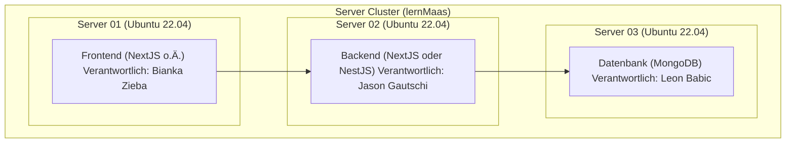

# Modul 321 - LB2

## Ecolm 2.0

> Bianka Zieba, Leon Babic & Jason Gautschi

Self made Ecolm: Wir möchten mit unserem Projekt eine kleine Applikation mit Frontend, Backend und Datenbank bauen, in der man **Noten speichern, einsehen und bearbeiten kann (inkl. Login)**. Dazu werden wir pro Person einen Server aufsetzen und einen **Cluster** aufbauen, damit auf **jedem Server ein Service** der Applikation laufen kann. Auf jedem Server sollten zwei Frontends und zwei Backends laufen. Mithilfe eines **LoadBalancer** sollten eingehende Requests aufgeteilt werden. Gespeichert werden die **Daten der Datenbank** mit einem **Cluster-Dateisystem**, falls mal ein Server ausfällt. Somit können wir sicherstellen, dass auf jedem Server die Datenbank laufen könnte, sollte ein Server ausfallen. Um den ganzen **Prozess zu vereinfachen**, werden wir auf unserem lernMaas einen **Kubernetes Cluster** aufsetzen für die **Autoskalierung, Netzwerk-Kommunikation und Failover**.

### Einfacher Aufbau

